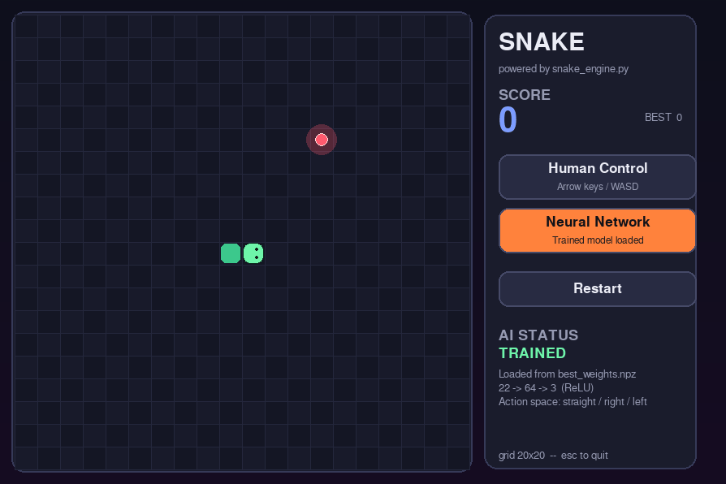

# Snake AI

A polished pygame-ce Snake game with a trainable neural-network agent.

The project cleanly separates concerns:

- **snake_engine.py** – pure game logic (no graphics, no I/O)
- **main.py** – rendering, input handling and the interactive UI
- **train_snake.py** – DQN training script that produces weights compatible with the game
- **record_ai_run.py** – records a full AI play-through and saves it as an animated GIF



---

## Quick start

```bash
pip install pygame-ce numpy torch imageio
python main.py